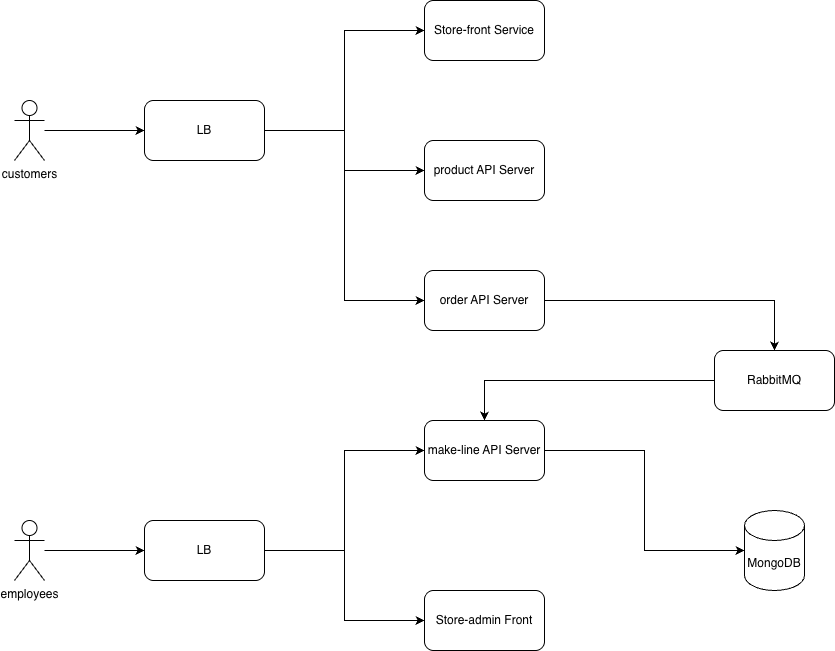

## youtube
https://www.youtube.com/watch?v=WS9RJA1lZxE

## Architecture


## Brief application explanation


This system architecture represents a microservices-based web application designed for an e-commerce or retail platform. It separates user roles and service responsibilities to ensure scalability, maintainability, and performance.

- **Customer-facing services** are accessed via a Load Balancer and include:
  - **Store-front Service** for browsing and shopping
  - **Product API Server** for retrieving product data
  - **Order API Server** for placing orders, which communicates asynchronously via **RabbitMQ**

- **Employee-facing services** are accessed through a separate Load Balancer and include:
  - **Make-line API Server** for processing and fulfilling orders
  - **Store-admin Front** for administrative tasks

- **RabbitMQ** acts as a message broker between the Order API and Make-line API, enabling asynchronous order handling.

- **MongoDB** serves as the central data store for order and production data.

This architecture ensures **clear separation of concerns**, supports **real-time and asynchronous workflows**, and is optimized for **multi-role access** and **scalable deployment**.

## Deployment instructions


### Prerequisites
- Kubernetes cluster 
- kubectl installed and configured
- Docker installed
- Access to Docker Hub images 

### Steps
1. Clone the repository `algonquin-pet-store-on-steroids`

2. Deploy all services:
   ```bash
   kubectl apply -f aps-all-in-one.yaml
   ```

3. Verify deployment:
   ```bash
   kubectl get pods
   kubectl get svc
   ```

4. Access the application:

   - check external IP from `kubectl get svc` for cloud clusters

5. Cleanup:
   ```bash
   kubectl delete -f aps-all-in-one.yaml
   ```

### Links Table

|service|repo address|
|--|--|
|store-front-L8|https://github.com/JunfengRong/store-front-L8|
|store-admin-L8|https://github.com/JunfengRong/store-admin-L8|
|order-service-L8|https://github.com/JunfengRong/order-service-L8|
|product-service-L8|https://github.com/JunfengRong/product-service-L8|
|makeline-service-L8|https://github.com/JunfengRong/makeline-service-L8|

|docker image|address|
|--|--|
|store-front|https://hub.docker.com/repository/docker/rong0010/store-front-l9|
|store-admin|https://hub.docker.com/repository/docker/rong0010/store-admin-l9|
|order-service|https://hub.docker.com/repository/docker/rong0010/order-service-l9|
|product-service|https://hub.docker.com/repository/docker/rong0010/product-service-l9|
|makeline-service|https://hub.docker.com/repository/docker/rong0010/makeline-service-l9|
